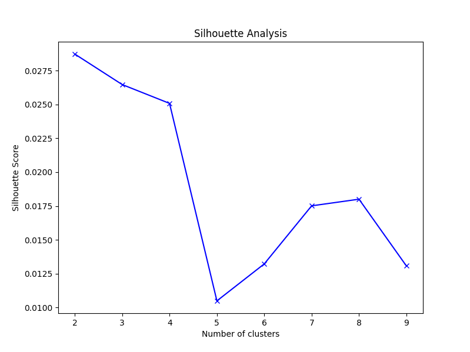
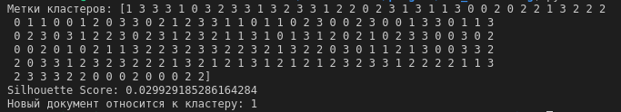

**Кластеризация и классификация текстовых документов**

Была разработана система, которая обрабатывает текстовые документы, получает их эмбеддинги, выполняет кластеризацию, а затем классифицирует новый документ(new_documents.txt) по ближайшему кластеру.

Для преобразования документов в векторные представления (эмбеддинг) используется библиотека: **sentence-transformers**.

Для проведения кластеризации: **KMeans**.

Для определения количество кластеров, используется **Silhouette Score**.



Для нахождения ближайшего кластера используется **косинусное расстояние**. 

Для запуска кода необходимо предустановить библиотеки из файла requirements.txt

```
pip install -r requirements.txt
```
Запуск кода:
```
python3 solutions/main.py
```
Терминальный результат:
